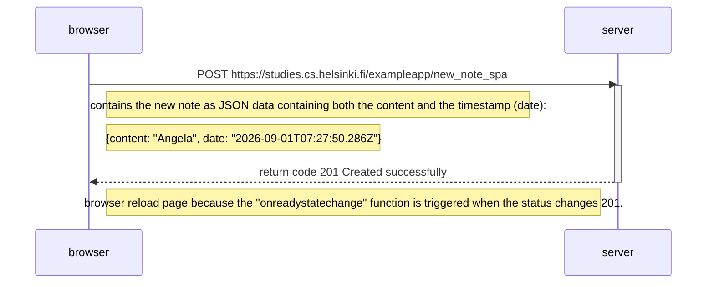

```mermaid
sequenceDiagram
    participant browser
    participant server

    browser->>server: POST https://studies.cs.helsinki.fi/exampleapp/new_note_spa
    activate server
    Note right of browser: contains the new note as JSON data containing both the content and the timestamp (date):
    Note right of browser: {content: "Angela", date: "2026-09-01T07:27:50.286Z"}
    server-->>browser: return code 201 Created successfully
    deactivate server
    Note right of browser:browser reload page because the "onreadystatechange" function is triggered when the status changes 201.

    
```